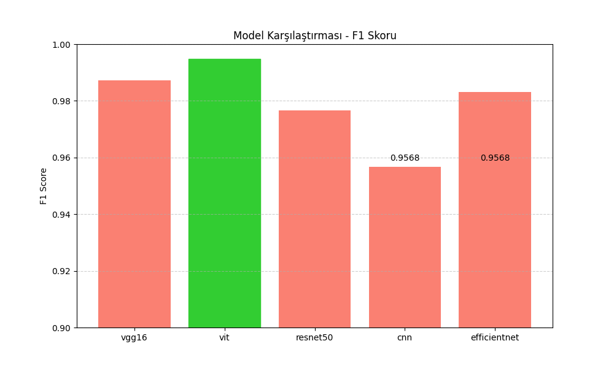

# Trafik Levhası Tanıma Sistemi (GTSRB + PyTorch)

Bu proje, Almanya trafik işaretleri veri seti (GTSRB) üzerinde çalışan, çeşitli derin öğrenme mimarilerini kullanarak trafik levhalarını tanımayı amaçlayan bir sistemdir.
Hem özel olarak eğitilmiş CNN modelleri hem de transfer öğrenme yaklaşımları (ResNet50, VGG16, EfficientNet, ViT) ile performans karşılaştırması yapılmıştır.

---

##  Amaç

- Trafik levhası tanıma sistemi geliştirmek
- Farklı yapay zeka mimarilerini karşılaştırmak
- GTSRB veri seti üzerinde çalışmak
- Model başarımlarını Accuracy, F1 Score ve Confusion Matrix ile değerlendirmek

---

##  Veri Seti: GTSRB

- Almanya Trafik İşaretleri Tanıma Benchmark'ı
- 43 sınıf
- 50.000+ görüntü
- Gerçek dünya koşulları (aydınlatma, bozulma, açı, bulanıklık)

Veri yapısı:

```
data/GTSRB/
├── train/
│   ├── 0/
│   ├── 1/
│   ├── ...
└── test/
    ├── 0/
    ├── 1/
    ├── ...
```

---

##  Kullanılan Model Mimarileri

| Model         | Tür              | Açıklama                      |
|---------------|-------------------|----------------------------------|
| SimpleCNN     | Özel CNN         | Temel yapı, referans modeli     |
| VGG16         | Transfer Öğrenme | ImageNet üzerinden öğrenilmiş  |
| ResNet50      | Transfer Öğrenme | Derin ve güçlü mimari         |
| EfficientNet  | Transfer Öğrenme | Hafif ve etkili                  |
| VisionTransformer (ViT) | Transformer | Yeni nesil, patch-tabanlı yaklaşım |

---

##  Kurulum

```bash
git clone https://github.com/hakan-kirik/TrafficSign-AI-Benchmark.git
cd trafik-levhasi-tanima

python -m venv venv
source venv/bin/activate  # veya Windows için venv\Scripts\activate

pip install -r requirements.txt
```

---

##  Eğitim

```bash
python train.py --model resnet50
```

Modeller şuralara kaydedilir:
```
checkpoints/
├── resnet50_best.pt
├── resnet50_last.pt
```

---

## Değerlendirme

```bash
python evaluate.py --model resnet50 --weight checkpoints/resnet50_best.pt
```

- Accuracy, F1 Score, Classification Report, Confusion Matrix
- Sonuçlar `results/` klasörüne kaydedilir

---

##  Sonuçlar (results/results.csv)

| Model        | Doğruluk (%) | F1 Skoru (%) |
| ------------ | ------------ | ------------ |
| ResNet50 | 58.63        | 58.36        |
| VGG16    | 31.59        | 31.15        |
| ViT      | 71.50        | 71.84        |
|  | Tam Ayar(Fine tuned) Sonuçları |
| CNN          | 95.72        | 95.68        |
| ResNet50     | 97.66        | 97.67        |
| VGG16        | 98.72        | 98.72        |
| EfficientNet | 98.33        | 98.31        |
| ViT          | 99.49        | 99.49        |

---

## Karşılaştırma Grafikleri

```bash
python compare_results.py
```

Grafikler:
- `charts/accuracy_comparison.png`
- `charts/f1_comparison.png`
  

---

##  Kaynaklar

- GTSRB: [Kaggle](https://www.kaggle.com/datasets/meowmeowmeowmeowmeow/gtsrb-german-traffic-sign)
- ResNet: He et al. (2016)
- ViT: Dosovitskiy et al. (2020)
- EfficientNet: Tan & Le (2019)

---

##  Geliştiren

Bu proje, bilgisayar gormesi dersi icin model karşılaştırma sistemi olarak [Hakan KIRIK](https://github.com/hakan-kirik) tarafından geliştirilmiştir.

---

## Lisans

MIT Lisansı © 2025

