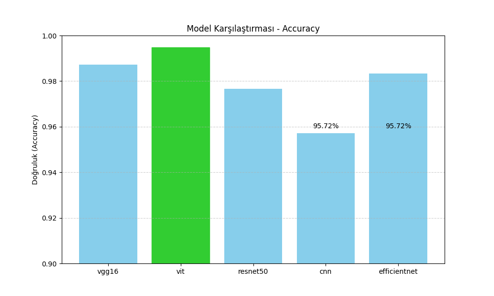

# Trafik İşaretlerinin Tanınmasında Derin Öğrenme Yöntemlerinin Karşılaştırmalı Analizi

## Özet

Bu çalışmada, trafik işaretlerinin otomatik olarak tanınması amacıyla farklı derin öğrenme yöntemleri karşılaştırılmıştır. Alman Trafik İşaretleri Veri Kümesi (GTSRB) kullanılarak gerçekleştirilen deneylerde CNN, VGG16, ResNet50, EfficientNet ve Vision Transformer (ViT) modellerinin performansları tam ve yarı ince ayar yöntemleri kullanılarak değerlendirilmiştir. Sonuçlar, tam ince ayarın tüm modellerde belirgin şekilde daha iyi performans sağladığını ortaya koymuştur. Vision Transformer, incelenen yöntemler arasında en yüksek doğruluk oranını yakalamıştır.

**Anahtar Kelimeler:** Trafik işareti tanıma, derin öğrenme, transfer öğrenimi, ince ayar, CNN, Vision Transformer, EfficientNet

## 1. Giriş

Otonom araçlar ve sürücü destek sistemlerinin yaygınlaşmasıyla trafik işaretlerinin otomatik olarak tanınması kritik önem kazanmıştır. Bu çalışma, yaygın derin öğrenme yöntemlerinin trafik işareti tanıma görevindeki performansını karşılaştırmakta ve tam ile yarı ince ayar yaklaşımlarının etkinliğini araştırmaktadır.

## 2. Literatür Taraması

Trafik işareti tanıma, bilgisayarla görme ve yapay zeka alanlarında uzun süredir araştırılan bir konudur. Özellikle otonom araçlar ve gelişmiş sürücü destek sistemlerinin gelişimiyle birlikte, bu alandaki çalışmalar daha da önem kazanmıştır.

### 2.1. Geleneksel Yöntemler ve GTSRB Veri Kümesi

Trafik işareti tanıma üzerine yapılan erken dönem çalışmalarda, genellikle renk ve şekil tabanlı özellik çıkarımı gibi geleneksel görüntü işleme teknikleri kullanılmıştır. Ancak bu yöntemler, değişen aydınlatma koşulları, kısmi örtüşmeler ve farklı perspektifler gibi gerçek dünya senaryolarında sınırlı başarı göstermiştir.

Bu zorlukları aşmak amacıyla, Stallkamp ve arkadaşları tarafından 2011 yılında sunulan Alman Trafik İşareti Tanıma Benchmark'ı (GTSRB), 43 sınıfa ait 50.000'den fazla trafik işareti görüntüsünü içeren kapsamlı bir veri kümesi olarak literatüre kazandırılmıştır. GTSRB, farklı ışıklandırma, hava koşulları ve perspektif değişikliklerini içeren çeşitli görüntülerle, trafik işareti tanıma sistemlerinin değerlendirilmesi için standart bir benchmark haline gelmiştir.

### 2.2. Derin Öğrenme Yaklaşımları

Derin öğrenme tekniklerinin gelişimiyle birlikte, trafik işareti tanıma alanında da önemli ilerlemeler kaydedilmiştir. Özellikle Evrişimli Sinir Ağları (CNN), görüntü sınıflandırma görevlerinde yüksek başarı oranları elde etmiştir. LeNet, VGG, ResNet gibi CNN mimarileri, GTSRB veri kümesi üzerinde yapılan çalışmalarda %99'a varan doğruluk oranlarıyla dikkat çekmiştir.

Bununla birlikte, CNN tabanlı modellerin sınırlı algılama alanı ve yerel özelliklere odaklanma eğilimi, küresel bağlam bilgisinin yeterince yakalanamamasına neden olmuştur. Bu durum, özellikle benzer görünüme sahip trafik işaretlerinin ayrımında zorluklar yaratmıştır.

### 2.3. Transformer Tabanlı Yaklaşımlar

Son yıllarda, doğal dil işleme alanında büyük başarılar elde eden Transformer mimarisi, bilgisayarla görme alanına da adapte edilmiştir. Dosovitskiy ve arkadaşları tarafından 2020 yılında sunulan Vision Transformer (ViT) modeli, görüntüleri sabit boyutlu parçalara ayırarak bu parçaları bir dizi olarak Transformer mimarisine beslemektedir. Bu yaklaşım, küresel özellik çıkarımını mümkün kılarak, özellikle karmaşık ve benzer sınıfların ayrımında üstün performans sergilemiştir.

ViT ve benzeri Transformer tabanlı modeller, GTSRB gibi veri kümeleri üzerinde yapılan çalışmalarda, CNN tabanlı modellere kıyasla daha yüksek doğruluk oranları elde etmiş ve trafik işareti tanıma görevlerinde yeni bir standart belirlemiştir.

## 3. Veri Kümesi

Çalışmada Alman Trafik İşaretleri Veri Kümesi (GTSRB) kullanılmıştır. Veri kümesi, 43 farklı trafik işareti sınıfına ait yaklaşık 50.000 görüntüyü içermektedir ve farklı ışık koşulları ile görüntüleme açılarından oluşmaktadır.

## 4. Kullanılan Yöntemler ve Araçlar


### Modeller ve Katman Detayları:

* **CNN:** Kodda tanımlanan `SimpleCNN` sınıfı, girişte üç kanallı görüntüler için iki adet Conv2D katmanı (32 ve 64 filtreli), her biri ReLU aktivasyon ve ardından MaxPool2D ile birleştirilmiştir. Ardından Flatten katmanı, 256 nöronlu bir tam bağlantılı (Linear) katman, ReLU ve Dropout (0.5 oranında) içerir. Son katman, 43 sınıf için çıkış verir.

* **VGG16:** `vgg16_finetune.py` dosyasında, önceden eğitilmiş VGG16 modeli temel alınmış ve `classifier[6]` katmanı özelleştirilmiştir. Bu katman üç kademeden oluşur: 512 -> 256 -> 43 nöron geçişleriyle, her adımda ReLU ve Dropout (sırasıyla 0.5 ve 0.3) kullanılmıştır. İnce ayar durumuna bağlı olarak yalnızca son katman eğitilmiştir veya tüm model serbest bırakılmıştır.

* **ResNet50:** `resnet50_finetune.py` içerisinde kullanılan ResNet50 modeli, `fc` (fully connected) katmanı GTSRB'nin 43 sınıfına göre yeniden tanımlanmıştır. Eğer `finetune=False` ise tüm katmanlar sabitlenir, aksi halde tüm model eğitilebilir hale gelir.

* **EfficientNet-B0:** `efficientnet.py` modülünde timm kütüphanesi kullanılarak EfficientNet-B0 modeli çağrılır. `create_model` fonksiyonu ile modelin çıkış katmanı doğrudan `num_classes=43` olacak şekilde yapılandırılır. Pretrained olarak başlatılır ve tüm model eğitilir.

* **Vision Transformer (ViT):** `vit.py` dosyasında kullanılan ViT modeli (`vit_base_patch16_224`), timm üzerinden çağrılmış ve `head` çıkış katmanı değiştirilmiştir: Linear -> 256 -> ReLU -> Dropout(0.3) -> Linear -> 43. Eğer `finetune=False`, tüm Transformer blokları sabitlenir ve yalnızca son sınıflayıcı katman eğitilir.

### Kullanılan Araçlar ve Kütüphaneler:

* **PyTorch:** Model oluşturma, eğitim ve değerlendirme süreçlerinde temel framework.
* **torchvision:** VGG16 ve ResNet50 gibi klasik modellerin yüklenmesi için kullanılır.
* **timm:** EfficientNet ve Vision Transformer gibi modern modellerin sağlanması.
* **scikit-learn:** Doğruluk, F1 skoru ve confusion matrix gibi metriklerin hesaplanması için kullanılır.
* **matplotlib & seaborn:** Görselleştirme ve karışıklık matrislerinin çizimi için kullanılmıştır.

## 5. Deneysel Sonuçlar

### Tam İnce Ayar Sonuçları

| Model        | Doğruluk (%) | F1 Skoru (%) |
| ------------ | ------------ | ------------ |
| CNN          | 95.72        | 95.68        |
| ResNet50     | 97.66        | 97.67        |
| VGG16        | 98.72        | 98.72        |
| EfficientNet | 98.33        | 98.31        |
| ViT          | 99.49        | 99.49        |

### Yarı İnce Ayar Sonuçları

| Model    | Doğruluk (%) | F1 Skoru (%) |
| -------- | ------------ | ------------ |
| ResNet50 | 58.63        | 58.36        |
| VGG16    | 31.59        | 31.15        |
| ViT      | 71.50        | 71.84        |

### Confusion Matrix

Her model için karışıklık matrisleri oluşturulmuş ve sınıf bazında doğruluk analiz edilmiştir.
#### Yarı ince ayar- Tam İnce Ayar 


### Karşılaştırma Grafikleri


## 6. Tartışma

Deneysel sonuçlar, tam ince ayar uygulamasının tüm katmanların eğitilmesi nedeniyle modellerde öğrenme kapasitesini artırdığını göstermektedir. Yarı ince ayarın sınırlı performans göstermesi, model genelleştirme yeteneğinin azalmasına işaret etmektedir. Vision Transformer'ın üstün performansı, görüntü verisindeki global ilişkilere odaklanmasından kaynaklanmaktadır.

## 7. Sonuç ve Öneriler

Çalışmanın sonuçları, trafik işareti tanıma problemlerinde tam ince ayarın önemini vurgulamaktadır. Gelecekteki çalışmalar, farklı veri kümeleri ve gerçek zamanlı uygulamalarla bu yöntemlerin daha geniş kapsamlı değerlendirmelerini içermelidir.

## Kaynaklar

* Stallkamp, J., Schlipsing, M., Salmen, J., & Igel, C. (2012). The German Traffic Sign Recognition Benchmark.
* Dosovitskiy, A., et al. (2020). An Image is Worth 16x16 Words: Transformers for Image Recognition at Scale.
* Tan, M., & Le, Q. V. (2019). EfficientNet: Rethinking Model Scaling for Convolutional Neural Networks.

## Ekler

### Ek 1: Kullanılan Modeller ve Kodlar

Çalışmada kullanılan modellerin eğitim ve değerlendirme süreçleri aşağıdaki gibidir:
#### CNN
```python

class SimpleCNN(nn.Module):
    def __init__(self, num_classes=43):
        super(SimpleCNN, self).__init__()
        self.net = nn.Sequential(
            nn.Conv2d(3, 32, 3, padding=1), nn.ReLU(), nn.MaxPool2d(2),
            nn.Conv2d(32, 64, 3, padding=1), nn.ReLU(), nn.MaxPool2d(2),
            nn.Flatten(),
            nn.Linear(64*16*16, 256), nn.ReLU(),
            nn.Dropout(0.5),
            nn.Linear(256, num_classes)
        )
    def forward(self, x):
        return self.net(x)

```
#### RESNET50
```python
def get_model(num_classes=43, pretrained=True, finetune=False):
    model = resnet50(pretrained=pretrained)
    if not finetune:
        for param in model.parameters():
            param.requires_grad = False
    model.fc = nn.Linear(model.fc.in_features, num_classes)
    for param in model.fc.parameters():
        param.requires_grad = True

    return model

```
#### EFFICINET
```python
def get_model(num_classes=43, pretrained=True):
    model = create_model("efficientnet_b0", pretrained=pretrained, num_classes=num_classes)
    return model

```
#### VGG16
```python
def get_model(num_classes=43, pretrained=True, finetune=False):
    model = vgg16(pretrained=pretrained)

    if not finetune:
        for param in model.features.parameters():
            param.requires_grad = False
        for param in model.classifier.parameters():
            param.requires_grad = False


    model.classifier[6] = nn.Sequential(
        nn.Linear(model.classifier[6].in_features, 512),
        nn.ReLU(),
        nn.Dropout(0.5),
        nn.Linear(512, 256),
        nn.ReLU(),
        nn.Dropout(0.3),
        nn.Linear(256, num_classes)
    )
    for param in model.classifier[6].parameters():
        param.requires_grad = True
    return model

```
#### VIT
```python
def get_model(num_classes=43, pretrained=True, finetune=False):
    
    model = create_model(
        "vit_base_patch16_224",
        pretrained=pretrained,
        num_classes=1000  
    )

    if not finetune:
        for param in model.parameters():
            param.requires_grad = False

    model.head = nn.Sequential(
        nn.Linear(model.head.in_features, 256),
        nn.ReLU(),
        nn.Dropout(0.3),
        nn.Linear(256, num_classes)
    )

    for param in model.head.parameters():
        param.requires_grad = True

    return model

```
Bu çalışma, trafik işareti tanıma alanında derin öğrenme yöntemlerinin etkinliğini değerlendirmek isteyen araştırmacılar için kapsamlı bir referans oluşturmaktadır.
